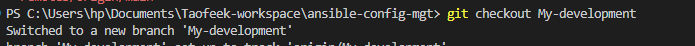

# INSTALL AND CONFIGURE ANSIBLE ON EC2 INSTANCE

`sudo apt update`

`sudo apt install ansible`

# Configure Jenkins build job to save your repository content

# Configure Webhook in GitHub and set webhook to trigger ansible build

# Configure a Post-build job to save all (**) files, like you did it in Project 9

# Prepare your development environment using Visual Studio Code

# In your ansible-config-mgt GitHub repository, create a new branch that will be used for development of a new feature.

# Checkout the newly created feature branch to your local machine 

`eval "ssh-agent -s"`

`ssh-add -k Downloads/Neyomr1.pem`

`ssh-add -l`

# Create dev.yml in inventory deirectory and common.yml in playbooks directory

`cd ansible-config-mgt`

`ansible-playbook -i inventory/dev.yml playbooks/common.yml`

