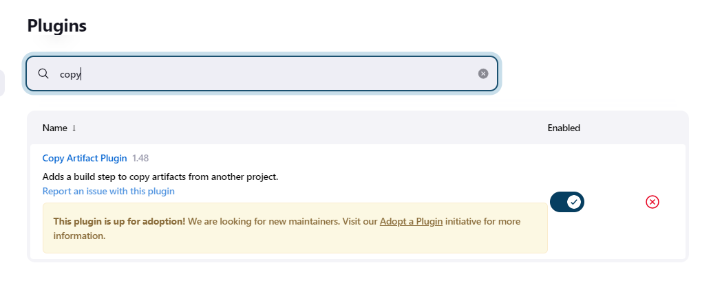
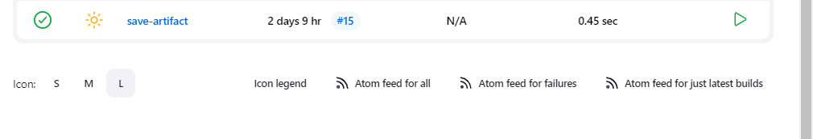
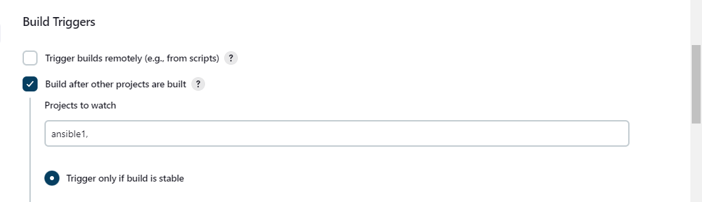
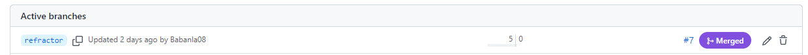
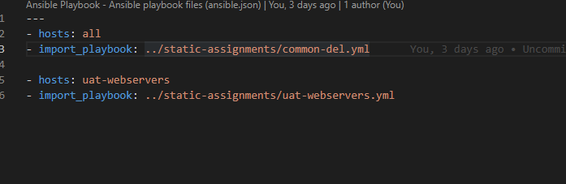
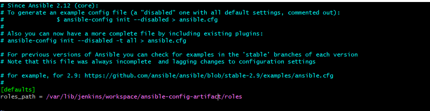
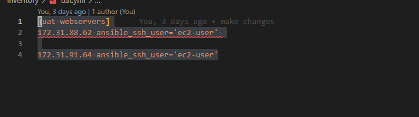
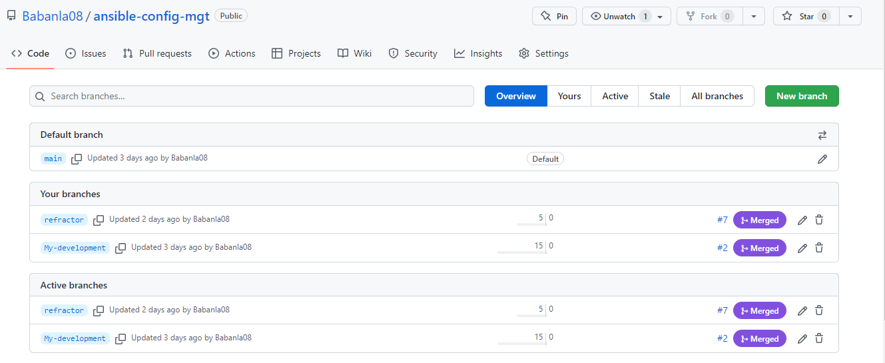
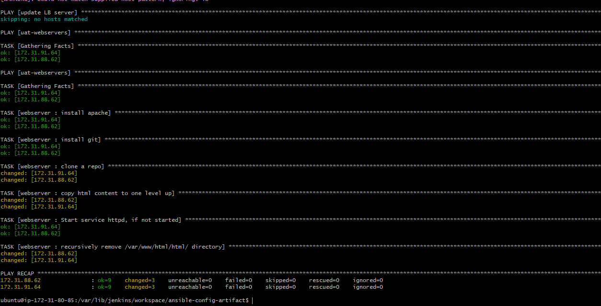

# ANSIBLE REFACTORING AND STATIC ASSIGNMENTS (IMPORTS AND ROLES)
#  Jenkins Jobs Enhancement

`mkdir /var/lib/jenkins/workspace/ansible-config-artifact`

`chmod -R 0777 /var/lib/jenkins/workspace/ansible-config-artifact`

# Download Copy Artifact Pluggin

# Create a New Job and Name it save-artifact

# Configure Your save-artifact to be Triggered by the Ansible Job

# Create new Branch in the Repository to Avoid Complexity

# Create new file and Name it site-yml in playbooks

`mkdir /var/lib/jenkins/workspace/ansible-config-artifact/playbooks`

`touch site.yml`

# Create a new folder in root of the repository and name it static-assignments

`cd /`

`mkdir /var/lib/jenkins/workspace/ansible-config-artifact/static-assignments`
# Move common.yml file into the newly created static-assignments folder

# Inside site.yml file, import common.yml playbook

`cd /var/lib/jenkins/workspace/ansible-config-artifact/playbooks`
`sudo vi site.yml`

`---
- hosts: all
- import_playbook: ../static-assignments/common.yml`

# create another playbook under static-assignments and name it common-del.yml

`cd /var/lib/jenkins/workspace/ansible-config-artifact/static-assignments`

`sudo touch common-del.yml`

`sudo vi common-del.yml`

`---
- name: update web, nfs and db servers
  hosts: webservers, nfs, db
  remote_user: ec2-user
  become: yes
  become_user: root
  tasks:
  - name: delete wireshark
    yum:
      name: wireshark
      state: removed

- name: update LB server
  hosts: lb
  remote_user: ubuntu
  become: yes
  become_user: root
  tasks:
  - name: delete wireshark
    apt:
      name: wireshark-qt
      state: absent
      autoremove: yes
      purge: yes
      autoclean: yes`

# update site.yml with - import_playbook: ../static-assignments/common-del.yml instead of common.yml and run it against dev servers

`ansible-playbook -i inventory/dev.yml playbooks/site.yml`

# Create roles

`mkdir roles`

`cd roles`

`ansible-galaxy init webserver`

# Update your inventory ansible-config-mgt/inventory/uat.yml file with IP addresses of your 2 UAT Web servers

# Create uat.yml file in your inventory directory 

`cd /var/lib/jenkins/workspace/ansible-config-artifact/playbooks`

`sudo touch uat.yml  && sudo vi uat.yml`

`[uat-webservers]
172.31.88.62 ansible_ssh_user='ec2-user' 

172.31.91.64 ansible_ssh_user='ec2-user'`

# In /etc/ansible/ansible.cfg file uncomment roles_path string and provide a full path to your roles directory roles_path    = /home/ubuntu/ansible-config-mgt/roles

`sudo vi /etc/ansible/ansible.cfg`

`cd /var/lib/jenkins/workspace/ansible-config-artifact/roles/webserver/tasks`

`sudo vi main.yml`
`---
- name: install apache
  become: true
  ansible.builtin.yum:
    name: "httpd"
    state: present

- name: install git
  become: true
  ansible.builtin.yum:
    name: "git"
    state: present

- name: clone a repo
  become: true
  ansible.builtin.git:
    repo: https://github.com/<your-name>/tooling.git
    dest: /var/www/html
    force: yes

- name: copy html content to one level up
  become: true
  command: cp -r /var/www/html/html/ /var/www/

- name: Start service httpd, if not started
  become: true
  ansible.builtin.service:
    name: httpd
    state: started

- name: recursively remove /var/www/html/html/ directory
  become: true
  ansible.builtin.file:
    path: /var/www/html/html
    state: absent`

    # Install and configure Apache (httpd service)
Clone Tooling website from GitHub https://github.com/<your-name>/tooling.git.
Ensure the tooling website code is deployed to /var/www/html on each of 2 UAT Web servers.
Make sure httpd service is started

  # Within the static-assignments folder, create a new assignment for uat-webservers uat-webservers.yml.

  `cd /var/lib/jenkins/workspace/ansible-config-artifact/static-assignments`

  `sudo touch uat-webservers && sudo vi uat-webservers.yml`

    `---
- hosts: uat-webservers
  roles:
     - webserver`

# Remember that the entry point to our ansible configuration is the site.yml file. Therefore, you need to refer your uat-webservers.yml role inside site.yml.

# Commit & Test

`git add .`

`git commit -m 'make changes'`

`git push`

#  Run the playbook against your uat inventory

`cd /var/lib/jenkins/workspace/ansible-config-artifact`

`ansible-playbook -i inventory/uat.yml playbooks/site.yml`

